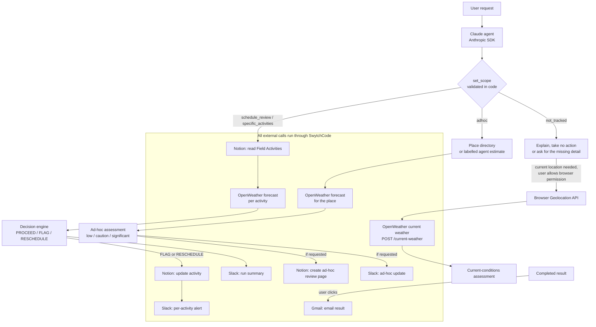

# FieldFlow AI

FieldFlow AI is an AI real-world operations continuity agent. You tell it what you need in plain language, such as "review tomorrow's field operations" or "check the weather for my hackathon in Gurgaon Sector 59", and it turns the request into a multi-step workflow. It reads operational records, pulls live weather, applies fixed risk rules, then updates Notion and tells the team on Slack only when that is warranted. Every external action runs through **SwytchCode**, and every step is recorded in an execution trace.

Built for **Build With SwytchCode: Gurgaon Edition**.

---

## The problem

Field teams have to combine several things before work starts:

- the planned operational context (what is scheduled, where and when)
- changing weather and environmental conditions
- operational rules about what is safe
- internal communication with the team
- record keeping

A raw weather forecast does not answer the question that matters: **"What should the operations team do next?"** FieldFlow is designed to answer it and then act on it.

---

## What FieldFlow does

### A. Tracked field operations

> "Review tomorrow's field operations and handle anything that could be affected by changing weather."

```
Notion planned activities → OpenWeather → deterministic decision engine
  → Notion update (only if needed) → Slack notification → explainable result
```

Each planned activity gets one decision: **PROCEED**, **FLAG** or **RESCHEDULE**. FieldFlow updates an existing Notion record, and sends a per-activity Slack alert, **only when intervention is actually required** (FLAG or RESCHEDULE). Each tracked review ends with one Slack run summary.

### B. Ad-hoc operational requests

> "Check the weather for my hackathon tomorrow in Gurgaon Sector 59."

An ad-hoc request does **not** need to exist as a Notion Field Activities record. FieldFlow:

- understands the request (event, place, date)
- resolves the place (see [Location resolution](#location-resolution))
- retrieves the forecast from OpenWeather through SwytchCode
- returns an ad-hoc weather assessment graded by the same fixed thresholds
- creates an **ad-hoc operational review page in Notion**, only if you ask for it
- posts the result to **Slack**, only if you ask for it

An ad-hoc request is **never** mapped to an unrelated tracked activity. Your Gurgaon hackathon is not treated as FA-101 just because FA-101 is also in Gurgaon.

### C. Current-location weather

> "Can you share the location and weather where I am right now?"

FieldFlow never guesses or infers where you are: not from your IP, account data, earlier messages or tracked records. The agent answers that it needs your current location, and the result offers a **Share my current location** button. This flow is separate from the planned-operations and ad-hoc workflows, and it takes no Notion or Slack actions.

1. Clicking the button calls the browser Geolocation API (`navigator.geolocation.getCurrentPosition`), so **your browser shows its own permission prompt**. Nothing continues unless you allow it.
2. The browser's latitude, longitude and accuracy are sent to FieldFlow's backend (`POST /current-weather`) for **this one lookup only**.
3. The backend gets current conditions through **SwytchCode's OpenWeather integration** (`openweather.2.5.weather.list`) and grades them with the same fixed thresholds.
4. The result shows your coordinates, the accuracy radius, conditions, temperature, rain in the last hour, wind, the **area name OpenWeather reports** for those coordinates, and a risk level. A badge says the location came from browser permission.

If you **deny** permission, FieldFlow says so and asks you to allow location access for the site or type a place instead (for example, "weather in Gurgaon Sector 59 tomorrow"). Nothing is sent to the backend. "Location unavailable", "timed out" and "browser not supported" are each reported separately. See [Security and privacy](#security-and-privacy) for exactly what is and isn't stored.

---

After any completed planned-operations or ad-hoc result you can click **Send this result to my Gmail** to email it to your connected account. This only happens when you click; nothing is emailed automatically.

---

## Why it is an AI agent

FieldFlow is not a chatbot wrapper. One Claude agent (Anthropic SDK, `claude-opus-5` unless `ANTHROPIC_MODEL` is set) runs a tool-use loop over ten guarded tools:

| Phase | What happens |
|---|---|
| **OBSERVE** | Understand the request and read the operational context from Notion |
| **REASON** | Declare the scope (`schedule_review`, `specific_activities`, `adhoc` or `not_tracked`) and decide which tools are needed |
| **DECIDE** | Evaluate the weather impact with **deterministic code**, not the model |
| **ACT** | Update Notion and/or notify Slack when appropriate |
| **VERIFY** | Return an execution trace, recorded by the tools themselves, plus a plain-language result |

The model understands the request, picks the workflow and tools, interprets the tool outputs and writes the explanations. The model never makes the operational decisions or sets the thresholds. It only refers to activities by ID, so locations, times, weather readings, decisions and Notion status values all come from code.

---

## Architecture



---

## SwytchCode integrations

**SwytchCode is the execution layer for all the external integrations.** Every Notion, OpenWeather, Slack and Gmail call goes through the SwytchCode runtime (`@swytchcode/runtime`) using these methods:

| Integration | What FieldFlow uses it for | SwytchCode methods |
|---|---|---|
| **Notion** | Read planned Field Activities; update tracked records when required; create ad-hoc operational review pages on request; seeding | `notion.children.get`, `notion.databas.get`, `notion.data_source.get`, `notion.query.create`, `notion.page.update`, `notion.page.create` |
| **OpenWeather** | Live 5-day / 3-hour forecast for tracked locations and resolved ad-hoc places; current conditions for a browser-shared location | `openweather.2.5.forecast.list`, `openweather.2.5.weather.list` |
| **Slack** | Per-activity FLAG/RESCHEDULE alerts, the run summary, and ad-hoc updates on request | `slack.conversations.list.list`, `slack.chat.postmessage.create` |
| **Gmail** | Email a completed result to the connected account, only when you click the button | `gmail.user.profile.get`, `gmail.user.send.create1` |

Full details and verified behaviour are in [docs/SWYTCHCODE-APIS.md](docs/SWYTCHCODE-APIS.md). One note: SwytchCode sends the managed OpenWeather key as a header, but OpenWeather reads it only from the `appid` query parameter. FieldFlow therefore passes `OPENWEATHER_API_KEY` from `.env` as the `appid` input to the same SwytchCode method.

### A multi-step chain, not isolated buttons

Each step's output drives the next one:

- **Tracked:** request → `Notion.read` (activities, locations, times) → `OpenWeather.forecast` (for each activity's own location and start time) → **decision engine** → `Notion.update` (only FLAG/RESCHEDULE) → `Slack.post` (alerts for those activities, then the run summary).
- **Ad-hoc:** request → **place resolution** → `OpenWeather.forecast` (at the resolved coordinates) → **weather assessment** → `Notion.create` review page (if requested, containing the assessment) → `Slack.post` (if requested, containing the assessment).
- **Current location:** request → agent reports that the current location is missing → user allows **browser geolocation** → `OpenWeather.current` (at those coordinates) → **current-conditions assessment**.

---

## Location resolution

SwytchCode's OpenWeather integration accepts **coordinates only**. It has no geocoding method and no place-name parameter, and FieldFlow does **not** geocode at runtime.

- **Tracked activities** use a fixed location table (`src/weather/locations.ts`) for the six demo cities.
- **Ad-hoc places** are resolved from a separate **place directory** (`src/weather/places.ts`). Its coordinates were looked up once in OpenStreetMap and pinned in the file:
  - **Gurgaon Sector 59:** 28.4030162, 77.1066682 (OpenStreetMap node 2735984441). "Gurugram Sector 59" and "Sector 59, Gurugram" also match; bare "Sector 59" deliberately does not, because Noida also has one.
  - **Rohini, Delhi:** 28.7063083, 77.1087892 (OpenStreetMap relation 21182288).
- **Any other place** falls back to the agent's own coordinate estimate, which is labelled "estimated by the agent" everywhere it appears.

The trace, the Notion review, the Slack post, the email and the UI all show where the coordinates came from, and the area name OpenWeather reports for them. There is **no traffic, route or commute integration**. If you mention where you're coming from, it's treated as context only.

---

## Decision engine

The LLM never invents thresholds. [`src/decision/engine.ts`](src/decision/engine.ts) applies fixed rules. Details are in [docs/DECISION-ENGINE.md](docs/DECISION-ENGINE.md).

| Signal | Threshold |
|---|---|
| Moderate rain | ≥ 2.5 mm/h (and < 7.6) |
| Heavy rain | ≥ 7.6 mm/h |
| High wind | sustained ≥ 10.8 m/s **or** gusts ≥ 17.2 m/s |
| Extreme heat | ≥ 40 °C |

| Activity type | RESCHEDULE | FLAG | PROCEED |
|---|---|---|---|
| `outdoor_inspection` | heavy rain | high wind or extreme heat | otherwise |
| `outdoor_installation` | heavy rain or high wind | moderate rain | otherwise |
| `indoor` | — | — | always |

Ad-hoc requests have no activity type, so the same thresholds grade them instead: heavy rain or high wind is **significant**, moderate rain or extreme heat is **caution**, and anything else is **low**.

---

## Safety and guardrails

These rules are enforced in code, not only in the prompt:

- Ad-hoc requests are never mapped to an unrelated tracked activity, and location alone cannot select a tracked activity.
- Tracked-activity tools only act on activities inside the scope declared with `set_scope`.
- A whole-schedule review is refused when the request introduces its own untracked event, place or route.
- PROCEED activities are never written to Notion and never get a per-activity Slack alert.
- Ad-hoc Notion and Slack actions only happen when the request asks for them.
- Gmail sends only on an explicit click, once per result; repeats are refused and a failed send can be retried.
- The UI only shows an action as done if its trace step succeeded, and tool failures are reported as failures.
- Simulated weather (`WEATHER_PROVIDER=mock`) is labelled as simulated everywhere.
- No traffic, route or commute analysis is claimed.
- The user's current location is never inferred. It is only used after the browser's permission prompt is granted, and is not stored by FieldFlow.
- API keys are masked in error messages, and secrets stay in `.env`, which is gitignored.

---

## Tech stack

Node.js (≥ 22; developed on 24) · TypeScript · Express · Anthropic SDK (`@anthropic-ai/sdk`) · `@swytchcode/runtime` · Zod · SwytchCode integrations: OpenWeather, Notion, Slack, Gmail. The frontend is a single dependency-free HTML page served by the backend.

---

## Setup

**1. Install**

```bash
npm install
```

**2. Swytchcode CLI.** Install the CLI (`npm install -g swytchcode`, or see cli.swytchcode.com), then log in and fetch the provider bundles declared in `.swytchcode/tooling.json`:

```bash
swy login
swy bootstrap
```

**3. Connect providers.** Credentials are stored locally by the CLI.

```bash
swy auth connect notion
swy auth connect slack
swy auth connect openweather
swy auth connect gmail          # optional: only needed for "Send this result to my Gmail"
swy auth status
```

**4. Notion.** Create a page containing a database titled **Field Activities** with these columns: `activity_id` (title); `activity_name`, `location`, `start_time`, `stakeholder`, `notes` (text); `date` (date); `activity_type`, `priority`, `status` (select). Share the page with the SwytchCode Notion connection. Ad-hoc review pages are created under this same page.

**5. Slack.** Create `#field-ops` (or set `SLACK_CHANNEL`) and run `/invite @swytchcode` in it.

**6. Environment.** Copy `.env.example` to `.env`, which is gitignored:

| Variable | Required | Purpose |
|---|---|---|
| `ANTHROPIC_API_KEY` | yes | Claude agent |
| `OPENWEATHER_API_KEY` | yes | Passed as `appid` to the SwytchCode OpenWeather method |
| `ANTHROPIC_MODEL` | no | Default `claude-opus-5` |
| `WEATHER_PROVIDER` | no | `mock` for labelled simulated weather |
| `SLACK_CHANNEL` | no | Default `field-ops` |
| `NOTION_ROOT_PAGE_ID` | no | The page that holds Field Activities |
| `NOTION_TABLE_TITLE` | no | Default `Field Activities` |
| `PORT` | no | Default `3000` |

**7. Seed the demo activities** from `test-data/activities.json`:

```bash
npx tsx scripts/seed-notion.ts
```

---

## Run

```bash
npm run typecheck
npm test
npm run dev          # or: npm start
```

Open **http://localhost:3000**, type a request, and click **RUN FIELDFLOW**. Or call the API directly:

```bash
curl -s -X POST http://localhost:3000/run -H "Content-Type: application/json" \
  -d '{"request":"Review tomorrow'"'"'s field operations and handle anything that could be affected by changing weather."}'
```

```bash
curl -s -X POST http://localhost:3000/run -H "Content-Type: application/json" \
  -d '{"request":"Check the weather for my hackathon tomorrow in Gurgaon Sector 59."}'
```

**Mock weather:** set `WEATHER_PROVIDER=mock` and restart. Tracked reviews then show 1 RESCHEDULE, 2 FLAG and 3 PROCEED, with every weather step labelled simulated.

Useful scripts: `scripts/seed-notion.ts [--reset]` (restore the demo rows), `scripts/show-activities.ts` (print Notion state), `scripts/run-agent.ts "<request>"` (one run from the terminal), `scripts/weather-check.ts`, `scripts/notion-check.ts`, `scripts/slack-test.ts`.

---

## API

| Endpoint | Purpose |
|---|---|
| `POST /run` `{ "request": "…" }` | Runs the agent and returns `request`, `status`, `summary`, `steps`, `activities`, `agent_summary`, `weather_provider`, `model`, `run_id`, `scope` and `adhoc` |
| `POST /email-result` `{ "run_id": "…" }` | Emails that completed result to the connected Gmail account, once; the agent is not re-run |
| `POST /current-weather` `{ "latitude", "longitude", "accuracy_m" }` | Current weather for coordinates the browser shared after permission; no agent run, nothing stored |
| `GET /health` | Liveness check |
| `GET /` | The FieldFlow UI |

Full contract: [docs/API-CONTRACT.md](docs/API-CONTRACT.md).

---

## Testing

```bash
npm test             # 58 tests
npm run typecheck
```

The tests cover:

- **Decision engine:** every rule branch and the threshold edges.
- **Tracked workflow guards:** unknown activity IDs, the order of steps, PROCEED never being written, and summary counts.
- **Scope safety:** the exact hackathon prompt, no proxy records, rejection of location-only matches, and natural-language schedule questions.
- **Ad-hoc workflow:** assessment levels, forecast summarising, and Notion/Slack only when requested.
- **Place resolution:** directory matches, the ambiguous "Sector 59", and the labelled fallback.
- **Gmail:** email content, the MIME encoding, and send-once / retry-after-failure / in-flight protection.
- **Incomplete requests:** a missing destination or current location is reported as missing, and weather, proxies and writes stay blocked.
- **Current location:** permission granted, permission denied, unavailable / timeout / unsupported, the weather lookup with coordinates, missing or invalid coordinates (rejected before any weather call), weather failure, and response mapping. Browser geolocation is tested with a fake, so no real location is used.

None of the tests call Notion, Slack or Gmail.

---

## Hackathon demo

1. Show the Notion **Field Activities** table (six planned activities for tomorrow).
2. Ask: *"Review tomorrow's field operations and handle anything that could be affected by changing weather."* Show Notion → OpenWeather → decision engine → Slack in the agent rail and the execution trace.
3. Ask: *"Check the weather for my hackathon tomorrow in Gurgaon Sector 59. Please record the operational review in Notion and update the team on Slack."* Show the live ad-hoc result, the new Notion review page and the Slack update.
4. Point out that FA-101 (also in Gurgaon) was **not** used as a proxy, and that the Field Activities rows did not change.
5. Optionally, click **Send this result to my Gmail**.
6. Optionally, ask *"Can you share the location and weather where I am right now?"*, click **Share my current location** and allow the browser prompt. Show the current conditions, the OpenWeather area and the accuracy.

---

## Security and privacy

- Never commit `.env` or API keys.
- **Current location:** coordinates are requested only through the browser's permission prompt and sent only for the one `/current-weather` lookup. FieldFlow does not keep them: nothing in localStorage, sessionStorage or IndexedDB, no server-side storage, and they're not written to FieldFlow's own server logs.
- **SwytchCode audit log:** every call runs through the SwytchCode CLI, which keeps a local execution audit on the server machine (`~/.swytchcode/audit/*.jsonl`). It records outbound request URLs, so it contains the coordinates of each current-location lookup, as well as the OpenWeather key in the `appid` parameter. Treat that directory as sensitive; `swy audit clear` deletes it.
- This is a hackathon demo, not a production service. `/run` and `/email-result` have no authentication or rate limiting, so add both before exposing the server publicly.
- Completed results are kept in memory (the last 50 runs) for the Gmail action, so they are lost on restart.
- The CLI stores SwytchCode provider credentials on the machine where you connected them. A hosted deployment needs those credentials available on the server.
